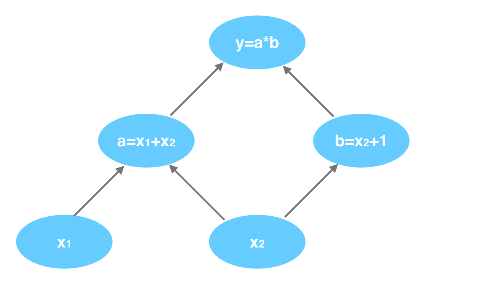

之前我们学会了构建神经网络，并通过手动调参的方式构建了一个XOR逻辑单元。然而我们并不能总是手动设置神经网络的参数，原因：一是我们通常无法知道如何构建参数(XOR的构建是因为其结构简单)。二是随着任务的复杂度加大，参数的规模急剧增加(很多网络包含千万级别甚至千亿级别的参数)，手动构建是不可能完成的事情。事实上我们也无需手动设置神经网络的参数，我们可以通过一些算法，例如**梯度下降(Gradient Descent)**与**反向传播算法(Back Propagation)**来完成参数的自动设置与调整。正如我们人拥有学习能力一样，我们可以通过数学让算法具备学习能力，这也正是深度学习的魅力所在。

# ANN自学习#

在Wikipedia中把“学习”定义为：*透过外界教授或从自身经验提高能力的过程。学习必须专心致志并持之以恒。*对于学习这一概念而言，相信所有人都很熟悉，毕竟不是一个陌生的概念。然而如果我们需要搞清楚人或者动物通过学习而提高能力的详细过程，还需要思考学习的本质是什么。

这里我们举一个例子：我们在很小的时候，学习说话，首先是模仿父母长辈说话，其次是父母长辈会告诉我们这样说不正确或者正确，通过一段时间的模仿练习我们便学会说话了。这一过程我们可以称之为练习与纠错的过程。这样的过程我们称之为监督学习。在机器学习中，我们把带有标记(可以反馈错误)的算法称之为**监督学习(Supervised Learning)**。深度学习同样如此。

### 用数学表示监督学习###

如果我们把神经网络用函数h(x)表示(以对话系统为例：x代表输入，即神经网络听到了一句话，h表示神经网络的输出，表示神经网络听到那句话后回了一句话)，用y表示我们期望神经网络的输出，那么我们可以使用**欧氏距离**来表示神经网络的输出误差，即**代价函数**：
$$
ξ=\frac{1}{2m}\sum_{i=1}^m||y_i-h_{w,b}(x_i)||^2
$$
其中ξ表示误差；m表示样本数量；x表示样本输入；y表示样本标记；i表示第i个样本；w与b是参数，分别表示连接权重与偏置。

我们期望神经网络的输出尽量与标记一致，即误差ξ最小。那么我们就将问题转化为了在输入x与输出y已知的情况下，求使误差J(为了与上式区分，此式子我们使用J表示误差)最小的参数w。即**最小化代价函数**：
$$
minJ(w,b)=min(\frac{1}{2m}\sum_{i=1}^m||y_i-h_{x_i}(w,b)||^2)
$$
那么我们现在需要做的就是求解J的最小值，我们知道求解函数的极值有很多种方法。例如，我们可以另导数为0，然后求解导函数的值来求得极值，但在很多函数中，导数为0所对应的方程是解不出来的。那么我们如何求解此函数的最小值呢？我们需要使用梯度下降法与反向传播算法来求解。

### 参数初始化###

全连接神经网络往往拥有较多的参数。参数的数量如何计算呢？每两层神经元之间互相连接，除去输入层神经元外每个神经元均有一偏置量。所以神经网络神经元的参数数量：
$$
num\_of\_args=\sum_{i=1}^{l-1}(L_i*L_{i+1})+\sum_{j=2}^lL_j
$$
其中l表示ANN的层数，i、j均表示当前层数，Li、Lj表示当前层的神经元个数。

在上一节当中，我们手动构造了神经网络的参数。这一节当中我们需要利用算法自动设置与跟新参数。然而我们仍然需要设置一个初始参数值，算法会在随后的训练过程中更新这些参数，最终达到我们想要的效果。

根据研究发现，设置不同的初始化参数值，算法的训练过程会有很大的不同。例如参数设置为全0，那么可能会使神经元在训练的过程中参数全都一致，造成算法无效。最简单的初始化方法是随机初始化，然而更好一些的方法是使用服从正态分布的较小的值来进行初始化连接权重（例如正态分布的均值为0，方差为0.001），使用0来初始化偏置值。

根据**中心极限定理**大量独立或近似独立的随机变量之和近似服从正态分布。所以我们经常以服从正态分布的值来作为权重。

### 梯度下降法###

**梯度下降法(Gradient Descent)**是一个一阶最优化算法，通常也称为**最速下降法**。 要使用梯度下降法找到一个函数的局部极小值，必须向函数上当前点对应梯度（或者是近似梯度）的反方向的规定步长距离点进行迭代搜索。如果相反地向梯度正方向迭代进行搜索，则会接近函数的局部极大值点；这个过程则被称为**梯度上升法**。

梯度在此处所指的是一阶偏导数。某一点的一阶偏导数的符号就相当于该点的距离最近的最低点的方向。

通俗来讲如果我们把目标函数比作一座山，我们站在山的任意一点，向脚下的各个方向观看，坡度最陡的方向就是梯度方向。梯度下降就是沿着梯度的方向进行下降。那么我们下降的距离是多少呢？通常直接使用导数值的绝对值是不合理的，我们会根据经验在不同的场景使用不同下降速率。可以看到沿着梯度的方向下降可以很容易下降到一个最低点。如果我们要求函数的最小值，那么我们只需要不断朝着梯度的方向下降直到梯度为0或近似为0时就可以找到最小值（有可能是局部最小值）了。

所以我们可以通过**训练(Train)**(多次迭代)代价函数来逐步更新参数值。

那么上面的误差函数J(w, b)的参数更新规则可以写成：
$$
W_{ij}^{(l)}=W_{ij}^{(l)}-\alpha\frac{\partial}{{\partial}W_{i,j}^{(l)}}J(W,b)
$$

$$
b_{i}^{(l)}=b_{i}^{(l)}-\alpha\frac{\partial}{{\partial}b_{i}^{(l)}}J(W,b)
$$

其中W表示连接权重参数，b表示偏置值，i、j表示某一层神经元的索引，l表示层的索引。

那么现在我们就需要求得所有参数的偏导数，如何求呢？

### 反向传播算法##

ANN的本质就是一个多层复合函数。如下：

其对应的表达式如下：
$$
a_1^{(2)}=f(W_{11}^{(1)}x_1+W_{12}^{(1)}x_2+W_{13}^{(1)}x_3+b_1^{(1)})
$$

$$
a_2^{(2)}=f(W_{21}^{(1)}x_1+W_{22}^{(1)}x_2+W_{23}^{(1)}x_3+b_2^{(1)})
$$

$$
a_3^{(2)}=f(W_{31}^{(1)}x_1+W_{32}^{(1)}x_2+W_{33}^{(1)}x_3+b_3^{(1)})
$$

$$
h_{w,b}(x)=a_1^{(3)}=f(W_{11}^{(2)}a_1^{(2)}+W_{12}^{(2)}a_2^{(2)}+W_{13}^{(2)}a_3^{(2)}+b_1^{(2)})
$$

如何求复合函数的偏导数呢？这里需要用到复合函数的链式求导法则与一些小技巧。

我们以求y=(x1+x2)*(x2+1)的偏导为例进行说明:

在图中引入了中间变量a、b。

利用链式求导法则可知：
$$
\frac{\partial y}{\partial x_1}=\frac{\partial y}{\partial a}·\frac{\partial a}{\partial x_1}
$$

$$
\frac{\partial y}{\partial x_2}=\frac{\partial y}{\partial a}·\frac{\partial a}{\partial x_2}+\frac{\partial y}{\partial b}·\frac{\partial b}{\partial x_2}
$$

可以看到：对x1求偏导走的路径是x1-a-y，对x2求编导走的路径是x2-a-y与x2-b-y。也就是说链式求导法则在上图的意义就是找到每一条通往某个节点的通路，在每条通路上求得所有偏导数的乘积，然后将所有通路的乘积相加就是到当前节点的偏导数。

同时可以看到有一些路径被重复访问了，比如上图中y对a求偏导。这样做会使得计算量大大增加了，为了避免这种情况，**反向传播算法(Back Propagation, BP)**算法应用而生。

同样是利用链式法则，BP算法则机智地避开了这种冗余，它对于每一个路径只访问一次就能求顶点对所有下层节点的偏导值。

正如反向传播算法的名字说的那样，BP算法是反向(自上往下)来寻找路径的。

BP算法

### 非凸函数优化与局部最优值###

### 神经网络的第一层与最后一层

传统的机器学习算法，我们往往需要对输入数据做很复杂的变换，再将变换的数据输入算法（事实上变换也可算作算法的一部分）当中。尽管专家们绞尽脑汁的对数据进行各种处理，然而效果始终不够理想。而深度学习往往不需要对数据做变换处理就能达到很好的效果。原因是：

1. ANN算法，在训练过程中，可以进行任意的非线性变换，以此来对数据进行拟合。所以无需考虑算法能否处理不同的复杂的数据的形式。
2. 通过数据变换，虽然可以使数据变得统一与易处理，但往往也会改变或丢失原数据中的部分特征。
3. 对数据的变换是复杂的，不同的数据需要做不同的变换处理，这样的工作会极大的增加算法设计的复杂度。

**那么如何设计ANN的结构呢？**

首先我们需要设定ANN的输入层与输出层结构。输入层负责数据输入，输出层则会输出运算结果。中间层结构往往比较多样，我们在以后的学习中会学到。

输入层通常直接或间接与输入数据相连接。例如对于图像数据，我们可以直接让输入层神经元分别与每一个像素相连接（事实上，我们通常并不直接连接，而是通过卷积单元与之相连，卷积单元也可看做是一种功能化的神经元）。

神经网络的最后一层往往需要进行一个变换处理。对于拟合一个数据结果，输出层可以设置一个神经元。对于分类问题，输出层可以根据分类情况设置不同数量、不同种类的神经元：对于二分类情况我们可以设置一个sigmoid神经元，以0.5为界限分类；对于多分类的情况，我们可以设置与类别数目一样多的神经元然后进行归一化处理，输出层神经元输出的值的和变为1，我们可以根据每个神经元的输出值的大小进行排序，以输出值最大者所在的索引来代表分类的情况。