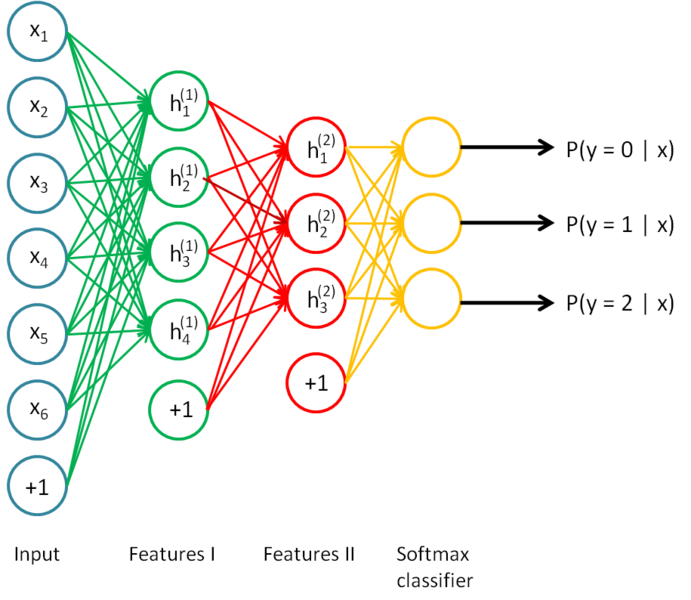

到目前为止，我们已经讨论了神经网络在监督学习中应用。在监督学习中，训练的样本是有类别标签的。现在我们要讨论深度学习在没有带标签的训练样本中的应用，所以这种算法属于无监督学习算法。神经网络中最常用的无监督学习算法是自编码器。同时自编码器也有很多变种。常见自编码器变种包括**稀疏自编码器(Sparse AE)**，**降噪自编码器(Denoising AE)**，**正则自编码器(Regularized AE)**，**边际降噪自编码器(Marginalized Denoising AE)**，**Contractive AE**，**变分自编码器(Variational AE, VAE)**，**条件变分自编码器(CVAE)**等。

### 自编码器

**自编码器(Autoencoder, AE)**往往也称为自编码算法。它是神经网络的一种，它尝试逼近一个恒等函数，从而使输出h接近于输入x。即自编码器是一种转换数据表现形式的算法。

抛开神经网络，仅是自编码器，其原理很简单。自编码器由编码器(Encoder)和解码器(Decoder)两部分组成。

上图编码器将输入信号x转换为信号y，解码器将编码y转换为输出信号x的近似值。
$$
y=f(x)
\\\hat{x}=g(y)=g(f(x))
$$
我们的目标是使输出信号尽可能的等于输入信号。

那么此处就有一个问题**如果f与g都是恒等映射，那么输出就永远等于输入，那么这样的变换就是没有意义的**。因此我们需要对中间信号y做一定的约束，这样系统往往能够学习出有趣的变换f与编码y。

*注意：自编码器的解码器输出近似等于输入，所以对我们来讲解码器并非我们所关注的重点，它仅仅是为了衡量编码之后是否可以还原数据。所以在我们构建（既训练）完成之后就不需要解码器了。此时编码y已经承载了输入信号几乎所有的信息，但以一种不同的形式。*

下图是一个自编码神经网络的示例。

这是一个三层的神经网络，输入层(x)与输出层(h)拥有相同数量的神经元。可以看到隐藏层(a)相当于编码器，输出层相当于解码器。样本的输入等于样本的标记（相当于数据没有标记，所以这是无监督学习）。

可以得到：
$$
\hat{x}=h(x)
\\J(x,\hat{x})=\frac{1}{m}\sum_{i=1}^{m}||x^{(i)}-\hat{x}^{(i)}||^2
$$
*此处我们使用的是均方误差代价函数，实际中根据不同情况使用不同的代价函数。*

通过梯度下降法训练神经网络，当训练结束后，这个网络即学习出了x—>a—>x的能力。对我们来说a是至关重要，因为他是在尽量不损失信息量的情况下，对原始数据的另一种表达。

### 降维

为了尽量学到有意义的表达，我们会给隐藏层加入一定的约束。约束的方法有很多。

首先我们可以使隐藏层的神经元数量小于输入层神经元的数量，也就是说从x—>a是一种**降维**操作。网络试图以更小的维度去描述原始数据而尽量不损失数据信息。当每两层之间的变换均为线性，且训练使用的是均方误差代价函数时，该网络等价于PCA。

降维的过程也可以看做是特征提取的过程(很重要的一点是：这是自动学会的)。通过提取特征不仅保留了原始的重要信息还使得数据的维度降低，相当于对数据进行了压缩处理。降维的内在原理是输入的特征是有内在联系的（即输入数据中隐含着一些特定的结构），算法通过训练发现了数据中的这些相关性。如果输入数据是完全随机的，比如输入的每一个特征都是与其它特征完全无关的独立同分布高斯随机变量，那么这一压缩表示将会非常困难（或者完成不可能）。

事实上，我们设置隐藏层神经元数量比输入层多，通过一些约束也可以达到特征提取的目的，这样的自编码器叫做**稀疏自编码器(Sparse Autoencoder, SAE)**。但这样做已经不再是降维的范畴，这一部分的内容我们在下一章会详细讲述。

### 降噪自编码器

**降噪自编码器(Denoising Autoencoder, DAE)**的核心思想是：一个能够从编码器恢复出原始信号的表达未必是最好的，能够对“被破坏/污染”的原始数据编码、解码，然后还能恢复原始数据，这样的特征才是好的。即我们希望自编码器具有鲁棒性。

如何设计这一的自编码器呢？

首先需要给样本数据加入噪声，比如随机的将输入x中的一部分置空(通常是一半)，这样看起来部分数据或部分特征丢失了。然后在误差迭代的时候选用样本原数据做标记。这样在迭代过程，自编码器就会尝试去还原破损数据。从这里也可以看出降噪自编码器的命名便是因为它可以擦除噪声。

**与使用未破坏的训练数据相比，破坏数据训练出来的自编码能够对原始数据进行降噪**。为什么会这样？

破坏数据意味着加入了噪声，在训练的过程中我们以原始数据做标记会告诉算法那些特征被破坏了，并予以重建。这一过程便是降噪的过程，所以学习到的算法便对原始数据有了降噪的能力。
$$
我们使用\tilde{x}表示加入噪声的输入,\tilde{x}=f(x)。则代价函数为
\\J=\frac{1}{m}\sum_{i=1}^m||x^{(i)}-h(\tilde x^{(i)})||^2
$$

*注意：由于稀疏自编码器拥有更好的特征表达，所以降噪自编码器通常是建立在稀疏自编码器的基础之上。*

##### 为什么自编码器均是三层？

目前我们讲到的自编码器、降噪自编码器（以及还未学习的稀疏自编码器）均是三层的神经网络，这是因为三层神经网络在运行梯度下降时不会出现梯度衰减（事实上新型结构的深层神经网络已经避免了梯度衰减的问题），可以快速的学到输入样本的特征。

### 栈式自编码器

前面讲到的自编码器均是三层无监督神经网络。这节我们讲到的**栈式自编码器(Stacked Autoencode, SAE)**是建立在降噪自编码器或稀疏自编码器之上，不再是三层的网络。

栈式自编码器是一个由多层稀疏自编码器（或降噪自编码器）组成的神经网络，其前一层自编码器的输出作为后一层自编码器的输入。最后我们往往会加入一个输出层对整个网络进行微调来达到解决实际问题的目的。

栈式自编码器的训练分为两个步骤：

1. 预训练(pre-training)阶段：模型本身就是一系列的自编码器，并分开训练这些自编码器。这一过程是无监督的。
2. 微调(Fine-tuning)阶段。给模型接上(softmax或line或sigmoid等)输出层，并进行有监督训练。

##### 具体实例

假设假设我们要训练一个4层的神经网络模型，用来进行MNIST手写数字分类。首先，你需要用原始输入训练第一个自编码器，它能够学习得到原始输入的一阶特征表示（如下图所示）。
$$
注意：以下h_i^{(j)}表示第j层第i个隐藏层神经元的输出。
$$

然后我们将这些一阶特征作为另一个自编码器的输入，训练第二个自编码器。使之学习到二阶特征。

最后我们将二阶特征作为softmax分类器的输入，训练得到一个能够将二阶特征映射到数字标签的模型。

最终，你可以将这三层结合起来构建一个包含两个隐藏层和一个最终softmax分类器层的栈式自编码网络。我们可以再对整个网络运行梯度下降进行参数微调，就可以达到很好的分类效果。

##### 利用预训练解决梯度消失问题

之前我们讨论了梯度消失问题，我们通过设置合理的代价函数可以在输出层避免了梯度消失的问题，但仍然无法避免隐藏层的梯度消失。

本节通过栈式自编码器我们逐层训练神经网络，再通过微调整个神经网络让其作为一个整体来解决问题，在逐层训练的过程中不存在梯度消失问题，微调阶段，我们往往不需要对参数进行大规模的更新（这里所说的“往往”是个不确定的概念，在进行复杂的任务时，预训练之后参数还是需要大规模更新的），所以梯度消失的影响也会降低。第三次深度学习的觉醒便是由预训练技术所引发的，可见预训练的重要作用了。

可以看到通过栈式自编码器我们可以加深神经网络的层数，梯度消失问题也在一定程度上得到了缓解。但这样的方法也并非没有缺点的。首先逐层训练使训练过程变得麻烦；其次随着网络层数的加深，微调的作用会越来越小，仍然没法完全避免梯度消失。最后，逐层训练的过程中，我们学习的是输入特征，然而最终输出可能还需要对输入特征进行复杂的变换，这一过程在栈式自编码器中无法学习到，只能依赖于微调，然而微调因为梯度消失可能起不到太大的作用。